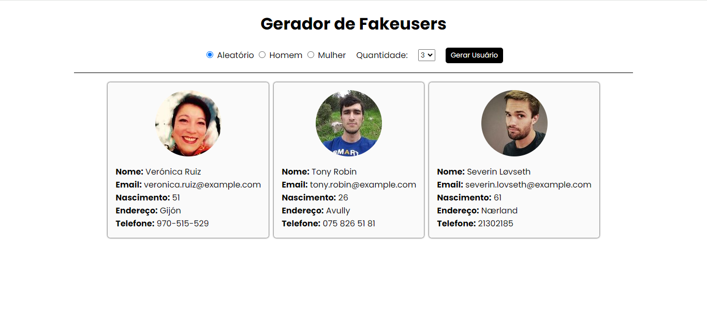
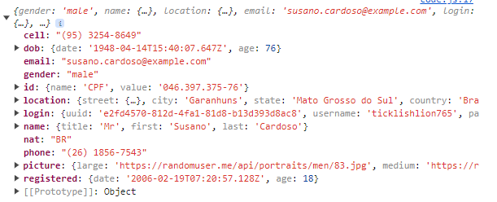

# Projeto Front-end de Gerador de Fakeusers

Este projeto tem o objetivo de gerar usuários fictícios usando a API pública https://randomuser.me/. O site https://www.anselme.com.br/2023/09/27/apis-gratuitas-random-user-generator/ também fornece maiores detalhes de como usar a API.

## Design do Projeto



## Uso do projeto

O projeto pode ser utilizado e testado através da seguinte URL: https://hennet.github.io/gerador-fakeuser/

## Utilização da API pública Random User

O site https://randomuser.me disponibliza o seguinte endpoint para a busca de 1 (um) usuário fictício, conforme mostrado abaixo:

```
URL: https://randomuser.me/api/?results=1
```

O resultado da busca consiste em um JSON com as seguintes informações abaixo. Considereando como exemplo a quantidade 1 (um) de usuários:

```
{
  "results": [
    {
      "gender": "male",
      "name": {
        "title": "Mr",
        "first": "Terrence",
        "last": "Palmer"
      },
      "location": {
        "street": {
          "number": 5207,
          "name": "Hickory Creek Dr"
        },
        "city": "Melbourne",
        "state": "South Australia",
        "country": "Australia",
        "postcode": 9419,
        "coordinates": {
          "latitude": "-82.2976",
          "longitude": "-110.1840"
        },
        "timezone": {
          "offset": "-3:00",
          "description": "Brazil, Buenos Aires, Georgetown"
        }
      },
      "email": "terrence.palmer@example.com",
      "login": {
        "uuid": "ea58599d-ad4f-48a1-8c26-80abec238925",
        "username": "blackgorilla589",
        "password": "shawna",
        "salt": "N1q8IOgt",
        "md5": "3c3a3c9e505144ea80fefed0cefd0438",
        "sha1": "073f16c6c6550a6eeff224bf4d7687e6d702ac44",
        "sha256": "b29e8d9e97df43db1da7702a14f78e243cbee6252a0756056661ec2e287f5bb7"
      },
      "dob": {
        "date": "1946-08-15T21:34:43.549Z",
        "age": 78
      },
      "registered": {
        "date": "2015-04-08T14:11:17.290Z",
        "age": 9
      },
      "phone": "09-7115-6131",
      "cell": "0464-451-633",
      "id": {
        "name": "TFN",
        "value": "215907997"
      },
      "picture": {
        "large": "https://randomuser.me/api/portraits/men/72.jpg",
        "medium": "https://randomuser.me/api/portraits/med/men/72.jpg",
        "thumbnail": "https://randomuser.me/api/portraits/thumb/men/72.jpg"
      },
      "nat": "AU"
    }
  ],
  "info": {
    "seed": "e1d7899e576ccd45",
    "results": 1,
    "page": 1,
    "version": "1.4"
  }
}
```

É possível informar que informações devem ser retornadas da api. Exemplo: retornando apenas os atributos _nome_, _picture_ e _gender_:

```
https://randomuser.me/api/?results=1&gender=&inc=name,picture,gender
```

Resultado:

```
{
  "results": [
    {
      "gender": "female",
      "name": {
        "title": "Miss",
        "first": "Marie",
        "last": "Oma"
      },
      "picture": {
        "large": "https://randomuser.me/api/portraits/women/12.jpg",
        "medium": "https://randomuser.me/api/portraits/med/women/12.jpg",
        "thumbnail": "https://randomuser.me/api/portraits/thumb/women/12.jpg"
      }
    }
  ],
  "info": {
    "seed": "630be14764d1327d",
    "results": 1,
    "page": 1,
    "version": "1.4"
  }
}
```

Exemplo de retorno capturado via javascript:


